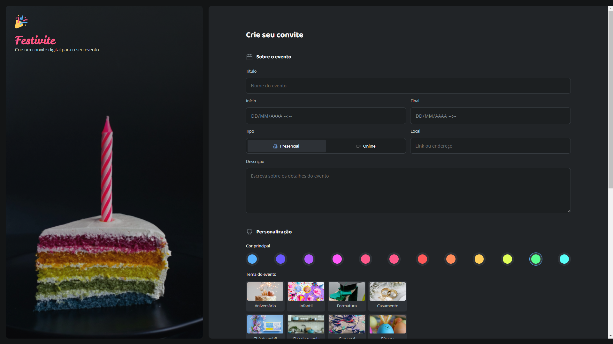

# Formulário para criação de convites personalizados

Projeto desenvolvido durante o curso de Full-Stack da Rocketseat, com o objetivo de aplicar na prática os conhecimentos adquiridos ao longo do curso.

## 🤖 Tecnologias utilizadas
- HTML
- CSS 

## 🎥 Apresentação do projeto
